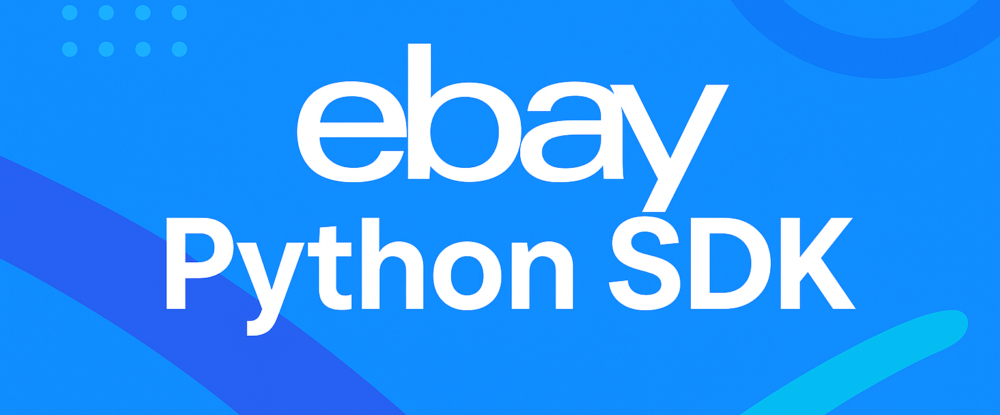

# ebay-rest · Modern Python SDK for eBay REST APIs

<!--  -->

[](#)
[](LICENSE)


>
> ⚠️ **Disclaimer**: This is an unofficial, community-maintained SDK. It is not affiliated with, endorsed by, or supported by eBay Inc.
>      Use at your own risk.

---

- [Features](#features)
- [Architecture Overview](#architecture-overview)
- [Quick Start](#quick-start)
- [Environment & Configuration](#environment--configuration)
- [Usage Examples](#usage-examples)
- [API Coverage](#api-coverage)
- [Roadmap](#roadmap)
- [Contributing](#contributing)
- [License](#license)

---

## Features

- ✅ **OAuth2 Authentication** - Client credentials grant with automatic token refresh
- ✅ **User Token Management** - Automatic refresh of expired user tokens (Sell APIs)
- ✅ **Browse API** - Search items and retrieve detailed item information
- ✅ **Orders API** - List and retrieve seller orders
- ✅ **Inventory API** - Full CRUD operations for inventory items
- ✅ **Account API** - Access account profiles, privileges, and policies
- ✅ **Type-Safe Models** - Pydantic models for all API responses
- ✅ **Comprehensive Tests** - 100+ unit and integration tests

## Architecture Overview

```
┌─────────────┐
│ EbayClient  │  ← entry point
└────┬────────┘
     │ creates once
┌────▼────────┐
│ BaseClient  │  ← auth, requests, error mapping
└────┬────────┘
     ├───────────────┐───────────────┐────────────────┐
┌────▼─────┐  ┌──────▼─────┐  ┌──────▼──────┐  ┌──────▼──────┐
│ Browse   │  │ Orders     │  │ Inventory   │  │ Account     │
│ Client   │  │ Client     │  │ Client      │  │ Client      │
└──────────┘  └────────────┘  └─────────────┘  └─────────────┘
```

- `OAuth2Client` handles client credentials token management (Buy APIs)
- `oauth` module provides Authorization Code flow helpers (Sell APIs)
- `BaseClient` centralizes HTTP operations with automatic error handling and token refresh

## Quick Start

```bash
git clone https://github.com/GustavoBelaunde2004/ebay-rest.git
cd ebay-rest
python -m venv .venv && source .venv/bin/activate  # or .venv\Scripts\activate
pip install -e ".[dev]"
cp ENV_TEMPLATE.txt .env && edit .env  # add EBAY_CLIENT_ID / SECRET
python examples/example_browse_test.py # smoke test browse API
```

### Minimal usage

```python
from ebay_rest import EbayClient
import os
from dotenv import load_dotenv

load_dotenv()  # Load environment variables from .env

client = EbayClient(
    client_id=os.getenv("EBAY_CLIENT_ID"),
    client_secret=os.getenv("EBAY_CLIENT_SECRET"),
    sandbox=True,
    # Optional: provide user tokens for Sell APIs (with automatic refresh)
    user_access_token=os.getenv("EBAY_USER_ACCESS_TOKEN"),
    user_refresh_token=os.getenv("EBAY_USER_REFRESH_TOKEN"),  # Recommended for auto-refresh
)

# Browse API: Search for items
results = client.browse.search_items(query="laptop", limit=10)
print(f"Found {results.get('total', 0)} items:")
for item in results.get('items', [])[:3]:
    print(f"- {item.get('title')} (${item.get('price', {}).get('value')})")
```

## Environment & Configuration

| Variable                 | Description                                                              |
|--------------------------|--------------------------------------------------------------------------|
| `EBAY_CLIENT_ID`         | Your sandbox/production App ID (client_id)                               |
| `EBAY_CLIENT_SECRET`     | Your Cert ID (client_secret)                                             |
| `EBAY_USER_ACCESS_TOKEN` | Optional user token for Sell APIs (from Authorization Code flow)         |
| `EBAY_USER_REFRESH_TOKEN` | Optional refresh token for automatic token refresh (recommended)         |
| `EBAY_REDIRECT_URI`      | URL-encoded Redirect URI (RuName) registered in eBay Developer Portal    |
| `EBAY_OAUTH_SCOPES`      | Space-delimited scopes for user consent (e.g. `https://.../sell.inventory`) |
| `EBAY_ENV`               | `sandbox` (default) or `production` for OAuth helpers                    |

- Store credentials in `.env` (gitignored). Helper scripts automatically load them.
- Use `examples/get_user_token.py` to obtain user access and refresh tokens.

### OAuth scopes

- **Buy scope** (default, included): `https://api.ebay.com/oauth/api_scope`
- **Sell Fulfillment** (orders): `https://api.ebay.com/oauth/api_scope/sell.fulfillment.readonly`
- **Sell Inventory** (inventory): `https://api.ebay.com/oauth/api_scope/sell.inventory.readonly`
- **Sell Account** (privileges/programs): `https://api.ebay.com/oauth/api_scope/sell.account.readonly`

> Client credentials tokens only cover Buy APIs. For Sell APIs you must obtain a **user access token**
> via the Authorization Code flow. Each seller runs through consent once; store their refresh token.

### Obtaining a Sell API user token

1. Register a redirect URI (RuName) in the [eBay Developer Portal](https://developer.ebay.com/my/keys)
2. Create a sandbox seller user: **Develop → Tools → eBay Sandbox → Create Test Users**
3. Set environment variables:
   ```env
   EBAY_CLIENT_ID=YourSandboxAppID
   EBAY_CLIENT_SECRET=YourSandboxCertID
   EBAY_REDIRECT_URI=YourEncodedRuName
   EBAY_OAUTH_SCOPES="https://api.ebay.com/oauth/api_scope/sell.inventory https://api.ebay.com/oauth/api_scope/sell.fulfillment"
   ```
4. Run the helper script:
   ```bash
   python examples/get_user_token.py
   ```
   This will open a browser for authorization and output both access and refresh tokens.
5. Add tokens to `.env`:
   ```env
   EBAY_USER_ACCESS_TOKEN=your_access_token
   EBAY_USER_REFRESH_TOKEN=your_refresh_token
   ```

### Automatic Token Refresh

User access tokens expire after 2 hours. The SDK automatically refreshes them if you provide a refresh token:

- **With refresh token**: Automatic refresh and retry on 401 errors (transparent to your code)
- **Without refresh token**: Manual refresh required using `oauth.refresh_user_token()`

Refresh tokens last ~18 months. Provide both tokens to `EbayClient` for seamless operation.

### Sandbox Setup

For Sell API testing, populate sandbox data via [Sandbox Seller Hub](https://sandbox.ebay.com/):
- Create inventory items (SKUs)
- Create listings/offers
- Place test orders (create buyer account in Developer Portal)

## Development & Testing

```bash
# Install dependencies
pip install -e ".[dev]"

# Run all tests
pytest

# Run with coverage
pytest --cov=ebay_rest --cov-report=term-missing

# Run integration tests (requires .env with credentials)
pytest -m integration

# Lint and format
ruff check . && black .

# Type checking
mypy ebay_rest
```

- **Unit tests**: 100+ tests with mocks for fast execution
- **Integration tests**: Real API calls against sandbox (requires credentials, skips if missing)
- **Coverage**: Run `pytest --cov=ebay_rest` for detailed reports

## Usage Examples

### Browse API

```python
results = client.browse.search_items(query="mirrorless camera", limit=3)
for item in results["items"]:
    print(item["title"], item.get("price", {}).get("value"))

item = client.browse.get_item(item_id=results["items"][0]["item_id"])
print(item["category_path"])
```

### Orders API

```python
orders = client.orders.list_orders(limit=10)
if orders["orders"]:
    order = client.orders.get_order(order_id=orders["orders"][0]["order_id"])
    print(order["buyer"]["username"])
```

### Inventory API

```python
# List and get items
inventory = client.inventory.list_inventory_items(limit=10)
if inventory["inventory_items"]:
    item = client.inventory.get_inventory_item(sku=inventory["inventory_items"][0]["sku"])
    print(item["availability"]["ship_to_location_availability"]["quantity"])

# Create item
client.inventory.create_inventory_item(
    sku="DEMO-SKU-001",
    inventory_item={
        "condition": "NEW",
        "product": {"title": "Demo Widget"},
        "availability": {"shipToLocationAvailability": {"quantity": 5}},
    },
)

# Bulk operations
client.inventory.bulk_create_or_replace_inventory_item([
    {"sku": "SKU-001", "condition": "NEW", "product": {"title": "Item 1"}},
    {"sku": "SKU-002", "condition": "USED", "product": {"title": "Item 2"}},
])
```

### Account API

```python
profile = client.account.get_account_profile()
print(f"Account type: {profile['account_type']}")

policies = client.account.list_return_policies(marketplace_id="EBAY_US")
```

### Pagination

```python
from ebay_rest.pagination import paginate

for item in paginate(
    client.browse.search_items,
    query="laptop",
    limit=100,
    items_key="items",
    limit_param="limit",
    offset_param="offset",
):
    print(item["title"])
```

## API Coverage

| Module     | Status | Methods                                                                       |
|------------|--------|-------------------------------------------------------------------------------|
| Auth       | ✅     | `OAuth2Client` - Client credentials grant with automatic token refresh        |
| OAuth      | ✅     | Authorization Code flow helpers (`build_authorization_url`, `exchange_code_for_token`, `refresh_user_token`) |
| BaseClient | ✅     | Shared HTTP client with error mapping (GET, POST, PUT, DELETE)                |
| Browse     | ✅     | `search_items`, `get_item` - Tested against sandbox                          |
| Orders     | ✅     | `list_orders`, `get_order` - Requires Sell Fulfillment scope + user token     |
| Inventory  | ✅     | `get_inventory_item`, `list_inventory_items`, `create_inventory_item`, `update_inventory_item`, `delete_inventory_item`, `bulk_create_or_replace_inventory_item` |
| Account    | ✅     | `get_account_profile`, `get_account_privileges`, `list_return_policies`, `list_payment_policies`, `list_shipping_policies` |
| Pagination | ✅     | `paginate()` generator function and `Paginator` class                         |

## Roadmap

- [x] Core APIs (Browse, Orders, Inventory, Account)
- [x] OAuth Authorization Code flow helpers
- [x] Automatic user token refresh
- [x] Comprehensive test coverage (100+ tests)
- [ ] Additional endpoints (offers, listings, etc.)
- [ ] Async client support
- [ ] PyPI publication

## Contributing

1. Fork and create a feature branch
2. Install dev dependencies: `pip install -e ".[dev]"`
3. Run checks: `pytest && ruff check . && black . && mypy ebay_rest`
4. Open a PR with clear description

See [CONTRIBUTING.md](CONTRIBUTING.md) for details. Bug reports and feature requests welcome via GitHub Issues.

## License

MIT © Gustavo Belaunde. See [LICENSE](LICENSE) for details.

## Credits

Built using [eBay REST APIs](https://developer.ebay.com/api-docs)

